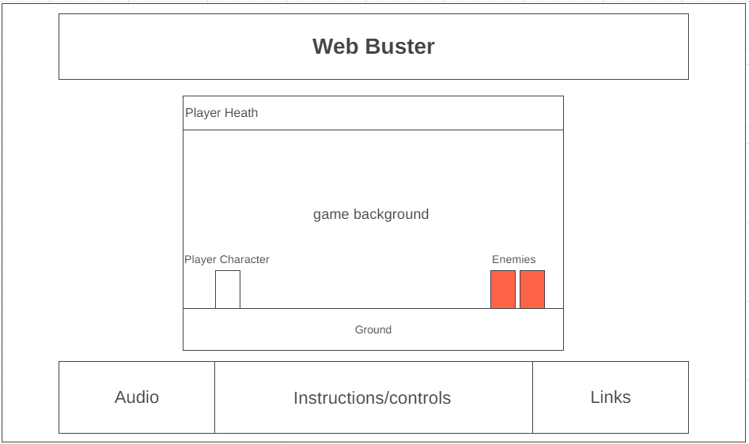

# [**Web Buster**](https://jiamin-zou.github.io/web-buster/)

 

---
## Background
---
**Web Buster** is 2D platform shooter game. The user will be able to control the player character to survive and fend off the incoming enemies. Player can set the difficulty which will scale the enemy health. After the player defeats certain amount of enemies, the boss will appear. Player must defeat the boss in order to clear the game. If at any point in the game the player's health reaches 0, it is game over.

**Note:** Boss will initiate an instant kill attack if it's not defeated after a certain amount of time.

 

---
## Instructions
---

 

---
## Functionality & MVPs
---
In **Web Buster**, users will be able to:

- Move the player character through keyboard input, as well as jumping in the air
- Shoot projectile to damage enemy
- Fight against boss enemy upon defeating set enemy count
- Set difficulty which will scale the enemy health

In addition, this project will include:
- Sound On/Off
- Instructions
- Production README

 

---
## Wireframe
---
<!-- https://wireframe.cc/UwwqTd -->

 

---
## Technologies, Libraries, APIs
---
- JavaScript
- HTML
- CSS/SCSS
- Canvas API
- Webpack
- Babel
- [Font Awesome](https://fontawesome.com/) icon library
- Text Font from [itch.io](https://tinyworlds.itch.io/free-pixel-font-thaleah)
- Sprite from [itch.io](https://itch.io/game-assets/free)
- Sound from (TBD)

 

---
## Implementation Timeline
---
- Friday Afternoon & Weekend
    - Define necesssary classes and set up inheritance chain
    - Ability to render different classes: Player, Enemy, Boss, & projectiles
    - Animate player corresponding to input: left, right, jump
    - Projectile animation (Player, enemy, boss)
- Monday
    - Enemy & Boss auto attack patterns
    - Collision detection and damage/health tracking
- Tuesday
    - Boss special attacks
    - Removing defeated enemy
    - Game clear / Game over / Replay
- Wednesday
    - BGM and SFX
    - Finish up any unfinished feature
    - Finish general html page and polish styling for better asthetics
- Thursday Morning
    - Final polish
    - Finish Production README

 

---
## Future Features
---
- [ ] Player special attack which will have a cooldown before it can be reused
- [ ] Enemy variety and more complex attack patterns
- [ ] Add Health recovery / Attack power up items with random chance to drop upon defeating enemy
- [ ] Additional levels
- [ ] Additional/different weapons for player

<!-- &check; -->
<!-- &cross; -->