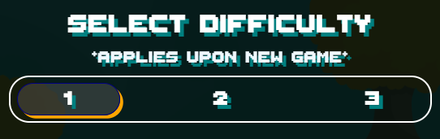

# [**Web Buster**](https://jiamin-zou.github.io/web-buster/)


---
## Background
---
**Web Buster** is 2D platform shooter game. The user will be able to control the player character to survive and fend off the incoming enemies. Player can set the difficulty which will scale the enemy health. After the player defeats certain amount of enemies, the boss will appear. Player must defeat the boss in order to clear the game. If at any point in the game the player's health reaches 0, it is game over.

**!!** Boss will initiate an instant kill attack if it's not defeated after a certain amount of time.

**Notes:**
- Currently boss has not been implemented yet. The game clears when player defeats the enemy
- BGM does work, but no SFX at the moment

<br>

---
## Play Instructions
---




Select the difficulty before starting the game. The difficulty will only apply when when game start/restart.
- Use your keyboard to control the player
    - Left and right arrow keys to move the player left and right of the screen
    - Up arrow key to jump
    - Space bar to shoot projectile
- Enemy will automatically chase plaeyr id player is in certain ranges and they will shoot at you! Dodge them and fire back!

- Player lose 1 HP when they touch an enemy or hit by a enemy projectile
- Upon getting hurt, you have 2.5 seconds of invinciblity
- Enemy have 1 second of invinciblity upon getting hurt

- Game ends when player depleted all their health or all enemy are defeated


<br>

---
## Functionality & MVPs
---
In **Web Buster**, users will be able to:

- Move the player character through keyboard input, as well as jumping in the air
- Shoot projectile to damage enemy
- Fight against boss enemy upon defeating set enemy count (Not yet Implemented)
- Set difficulty which will scale the enemy health
- Background dynamatically scroll giving depth effect (parallax scrolling)
- BGM sound with Play/Pause

In addition, this project will include:
- Instructions
- Production README

<br>

---
## Code Snippets
---
- Dynamic HP Bar display using combination of CSS and also JavaScript
```js
// JavaScript code
    updateHealthDisplay() {
        const health = this.game.player.health;
        this.hpDisplay.innerText = health;
        const hp = document.createElement("li");

        if (this.hpBar.children.length < health) {
            for (let i = hp.children.length; i < health; i++) {
                this.hpBar.appendChild(hp)
            }
        } else if (this.hpBar.children.length > health) {
            for (let i = health; i < this.hpBar.children.length; i++) {
                const lc = this.hpBar.lastChild;
                if (lc) this.hpBar.removeChild(this.hpBar.lastChild);
                
            }
        }
    }
```

```css
    li {
        list-style: none;
        margin: 2px;
        width:30px;
        height: 10px;
        border-radius: 5px;;
        list-style: none;
        background-image: linear-gradient(to bottom right, limegreen, greenyellow);
        border: 3px groove rgb(3, 156, 3);
        box-shadow: 2px 2px rgba($color: #dd7a08d5, $alpha: 0.8);
    }
```


<br>

- Enemy Auto Chasing

```js
update() {
    // movement to chase player if player is within chase range and sopt range
    const player = this.game.player;
    const [playerX, playerY] = player.pos;
    const [enemyX, enemyY] = this.pos;
    const dist = Util.dist(player.pos, this.pos);
    
    if (dist < this.chaseRange) {
        const speed = this.speed;
        if (playerX < enemyX) {
        this.dir = "left";
        this.img = this.runLeft;
        this.vel[0] = -speed;
        } else {
        this.dir = "right";
        this.img = this.runRight;
        this.vel[0] = speed;
        }
        
        if (dist <= this.stopRange) {
        this.vel[0] = 0;
        }
        
        this.shoot()
        // Check if on the ground before allowing jump
        // && if playerY is at least 75px above enemy + (offset height different)
        if (!this.inJump && playerY < enemyY - 75 + (player.dHeight - this.dHeight)) {
        const jumpHeight = 12;
        this.vel[1] = -jumpHeight;
        this.inJump = true;
        }
        } else {
        this.vel[0] = 0;
        // if player not within distance, stand idle 
    }
    super.update();
}
```


<br>

---
## Wireframe
---
<!-- https://wireframe.cc/UwwqTd -->


Updated Wireframe


<br>

---
## Technologies, Libraries, APIs
---
- JavaScript
- HTML
- CSS/SCSS
- Canvas API
- Webpack
- Babel
- [Font Awesome](https://fontawesome.com/) icon library
- Text Font from [itch.io](https://tinyworlds.itch.io/free-pixel-font-thaleah)
- Sprite from [itch.io](https://itch.io/game-assets/free)
- Sound from (TBD)

<br>

---
## Implementation Timeline
---
- Friday Afternoon & Weekend
    - Define necesssary classes and set up inheritance chain
    - Ability to render different classes: Player, Enemy, Boss, & projectiles
    - Animate player corresponding to input: left, right, jump
    - Projectile animation (Player, enemy, boss)
- Monday
    - Enemy & Boss auto attack patterns
    - Collision detection and damage/health tracking
- Tuesday
    - Boss special attacks
    - Removing defeated enemy
    - Game clear / Game over / Replay
- Wednesday
    - BGM and SFX
    - Finish up any unfinished feature
    - Finish general html page and polish styling for better asthetics
- Thursday Morning
    - Final polish
    - Finish Production README

<br>

---
## Future Features
---
- [ ] Sound effects (SFX)
- [ ] Boss Fight
- [ ] Player special attack which will have a cooldown before it can be reused
- [ ] Enemy variety and more complex attack patterns
- [ ] Add Health recovery / Attack power up items with random chance to drop upon defeating enemy
- [ ] Additional levels
- [ ] Additional/different weapons for player

<!-- &check; -->
<!-- &cross; -->